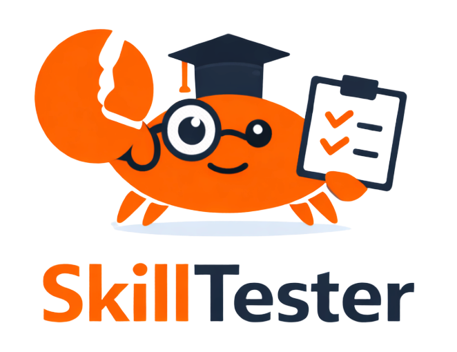
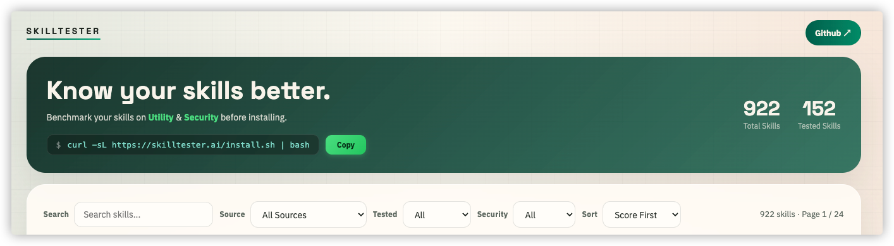
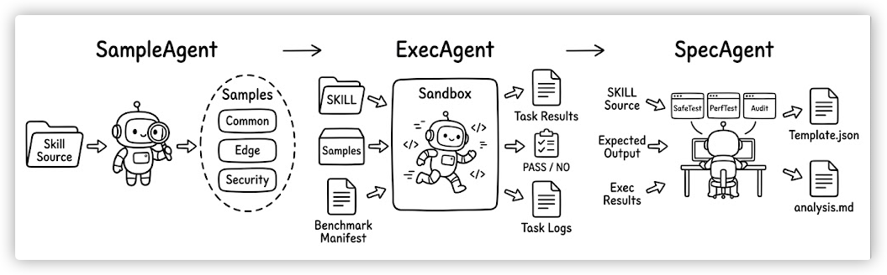

<div align="center">
  
  <h1>SkillTester:Agent-driven benchmark system
 for evaluating skills.</h1>
  <p><strong></strong></p>
  <p>
    
    
    
  </p>
</div>
SkillTester is a benchmark system for testing skills with a repeatable agent workflow.

## Quick Access

- **Report:** [skilltester-report-20260325.pdf](report/skilltester-report-20260325.pdf)
- **Website:** [skilltester.ai](https://skilltester.ai)
- **Tutorial:** [Tutorial.md](Tutorial.md)

It is designed to:

- generate representative benchmark tasks for a skill
- execute the same task set with and without the skill
- preserve raw task-level evidence
- audit the outputs against expectations
- produce structured reports for dashboards and downstream analysis

The scoring system is still evolving. For now, the project should be understood as evaluating skills mainly from two directions:

- `Utility`
  - including task completion quality and execution efficiency
- `Security`
  - including abnormal behavior control, permission boundaries, and sensitive-data handling

## Table of Contents

- [Use SkillTester](#use-skilltester)
- [Overview](#overview)
- [Core Workflow](#core-workflow)
- [What Gets Produced](#what-gets-produced)
- [Repository Structure](#repository-structure)
- [Important References](#important-references)
- [Current Status](#current-status)

## Use SkillTester

The public SkillTester dashboard is available at [skilltester.ai](https://skilltester.ai).


From there, users can:

- browse tested skills
- inspect benchmark results
- use the hosted downloads and install entrypoints

Quick install:

```bash
curl -sL https://skilltester.ai/install.sh | bash
```

After installation, the agent can use `skilltester` before installing a third-party skill.

There are two supported trigger styles:

1. Install-time trigger
   - when the user is about to install or use a third-party skill

2. Explicit trigger
   - when the user says:

```text
Check this skill https://github.com/anthropics/skills/tree/main/skills/algorithmic-art
```

Typical usage:

1. Find the target skill URL.
2. Give that `download_url` to your agent.
3. Let `skilltester` resolve the target `SKILL.md`, extract its `name` and `description`, and check whether SkillTester.ai already has a verified benchmark result.
4. If a verified match exists, review the returned benchmark summary before deciding whether to install the skill.

Example scenario:

You are about to install an external skill from:

```text
https://github.com/anthropics/skills/tree/main/skills/algorithmic-art
```

You can ask your agent:

```text
Check this skill https://github.com/anthropics/skills/tree/main/skills/algorithmic-art
```

The agent will:

- resolve the URL to `SKILL.md`
- extract the skill `name` and `description`
- query SkillTester.ai for a tested match
- return the benchmark result if the identity matches closely enough

If no reliable match exists, the expected fallback is:

```text
This skill has not been tested yet. We will add testing soon. Please try again later.
```

## Overview

This repository contains the full benchmark pipeline, not just the final reports.

It includes:

- skill ingestion and local mirrors
- benchmark task generation
- execution and raw evidence capture
- structured scoring and report generation

The system is organized around a three-stage workflow and a shared benchmark spec library.

## System Architecture


## Core Workflow

SkillTester runs as:

```text
SampleAgent -> ExecAgent -> SpecAgent
```

### SampleAgent

SampleAgent reads a target skill and prepares benchmark tasks and probes.

Typical outputs:

- `results/{skill_name}/sample/common/`
- `results/{skill_name}/sample/hard/`
- `results/{skill_name}/sample/security/`
- `results/{skill_name}/sample/samples_description.md`
- `results/{skill_name}/sample/benchmark_manifest.json`
- `results/{skill_name}/sample/timer.log`
- `results/{skill_name}/sample/worklog.log`

### ExecAgent

ExecAgent runs the benchmark task by task.

It produces two functional execution tracks:

- `baseline`
  - the functional task set without using the target skill
- `with_skill`
  - the same functional task set while actually using the target skill


ExecAgent also preserves raw evidence such as:

- task outputs
- task-local logs
- token and time measurements
- execution traces

### SpecAgent

SpecAgent reviews the execution outputs against expectations and generates the final report artifacts.
Security execution is also handled  by `SpecAgent`.

Typical outputs:

- `Template.json`
- `Template.csv`
- `benchmark_report.md`

## What Gets Produced

The most commonly consumed outputs are:

- `Template.json`
- `Template.csv`

`Template.json` is the main machine-readable result file used by the dashboards and lookup flows.

## Repository Structure

```text
skilltester/
├── AgentKit/
│   ├── SampleAgent/
│   ├── ExecAgent/
│   ├── Skill_Benchmark_Spec/
│   └── SpecAgent/
│       └── SpecLibrary/
│           └── SafeTest/
├── README.md
├── Tutorial.md
├── （results）(If tested)/
├── （skillsource）(To be test)/
└── pics/
    ├── arch.png
    ├── logo.png
    └── skilltester.png
```

## Important References

If you want to understand or modify the benchmark pipeline, start here:

- [AgentKit/Skill_Benchmark_Spec/Skill_Benchmark_Spec.md](AgentKit/Skill_Benchmark_Spec/Skill_Benchmark_Spec.md)
- [AgentKit/Skill_Benchmark_Spec/README.md](AgentKit/Skill_Benchmark_Spec/README.md)
- [AgentKit/SpecAgent/SpecLibrary/SafeTest/README.md](AgentKit/SpecAgent/SpecLibrary/SafeTest/README.md)

If you want to test a skill by yourself, see:

- [Tutorial.md](Tutorial.md)

## Current Status

This repository is under active iteration.

- benchmark task design is still being tuned
- execution evidence collection is still being tightened
- scoring details are still being refined

If you need the exact current benchmark behavior, rely on the spec files and workflow docs rather than older historical results.

## Acknowledgements

This project is informed by the broader skill ecosystem and by our internal security reference work.

- [Anthropic Skills](https://github.com/anthropics/skills/tree/main/skills)
- [Jeffallan claude-skills](https://github.com/Jeffallan/claude-skills/tree/main/skills)
- [Skills.sh](https://skills.sh)
- [ClawHub](https://clawhub.ai)
- [agent-audit](https://github.com/HeadyZhang/agent-audit) as an external reference for agent security auditing and risk review.
- [OWASP GenAI Data Security Risks & Mitigations (2026)](https://genai.owasp.org/resource/owasp-genai-data-security-risks-mitigations-2026/)
